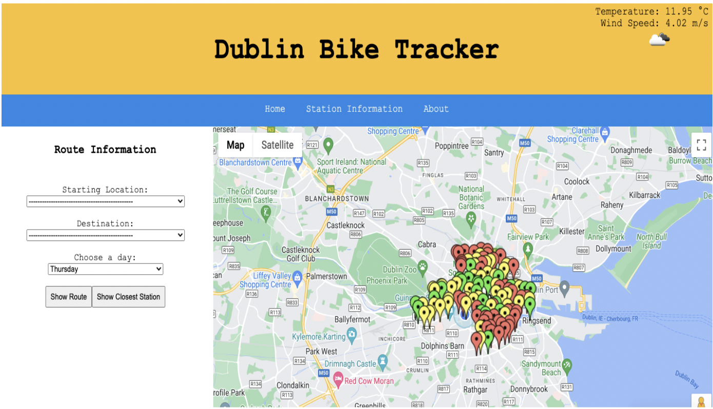

# Dublin Bikes Application

The goal of this project was to develop a web application to display occupancy and weather information for the Dublin Bikes by retrieving data from the JCDecaux API and OpenWeatherMap API. 

Clicking a station marker will query the database for the most recent data for that station. New data is inserted into the database every five minutes meaning that the user will see data that is no more than five minutes old at the time of clicking a marker. While the application guarantees the most recent station data is available to the user, it is dependent on how often the JCDecaux API updates, which can be at irregular intervals for each station. For clarity, the amount of time that has passed since a station's last update is also listed in the pop up window.

Upon loading the map, markers are designated a color based on the number of available bikes at that station. 

Details on the full application architecture can be found [here](dublinBikesApp_ProjectReport.pdf).

## Data 

Bike station data is routinely [scraped](Bikes_API_Request.py) from the JCDecaux API with the data being sorted into dynamic and static. After being sorted, this data is stored in a relational database on Amazon RDS which consists of three tables, Station, Bikes and Weather.   

Weather data was [scraped](Weather_API_Request.py) from the OpenWeatherMaps API and inserted into the Weather table. This data was originally going to be implemented in the machine learning algorithm, however this feature was later discarded and so the data in this table is not used. Using Javascript, the weather data displayed on the web page is the result of a direct request to the OpenWeatherMap API.

Queries are sent to both tables using the Python Flask application, which also reformats the results into JSON and passes this data to the Javascript within the HTML documents.

## Prediction Modelling

In order to estimate future bike availability, the historical station data from the database was used to train machine-learning models. Models assessed were the Linear Regression Model and Random Forest Regressor by comparing their Mean Absolute Error and Root Mean Squared Error. The Random Forest Regressor performed better on both metrics and hence was the model chosen. 

Group members: Daniel Howes, Mark Kavanagh & Conor Kennedy.

